# Notification System Architecture Diagrams

## System Overview

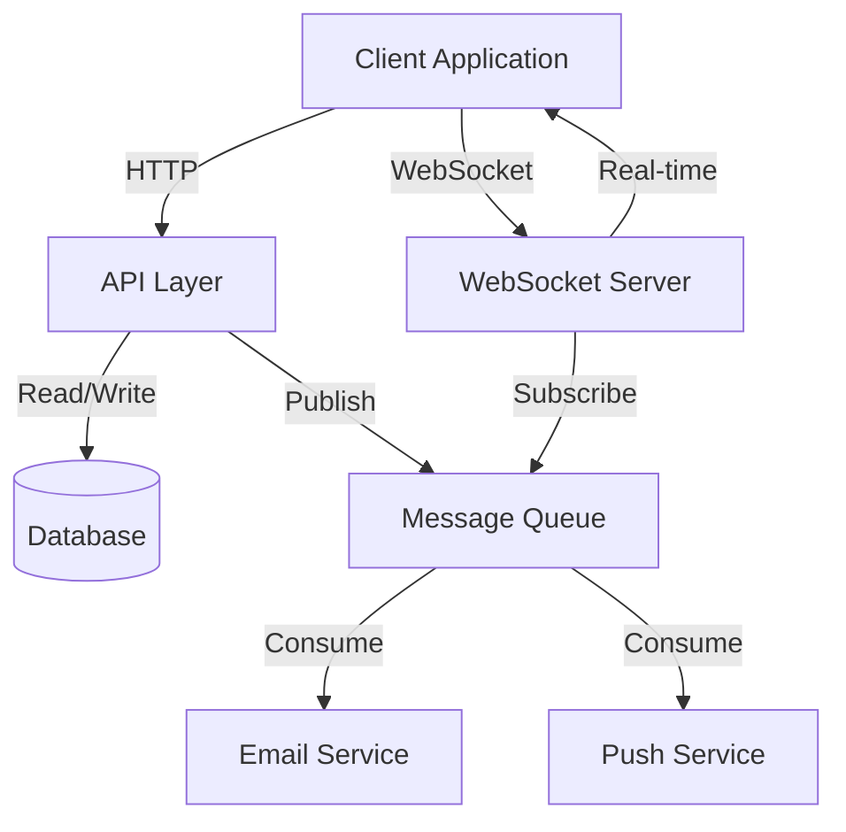

## Notification Flow

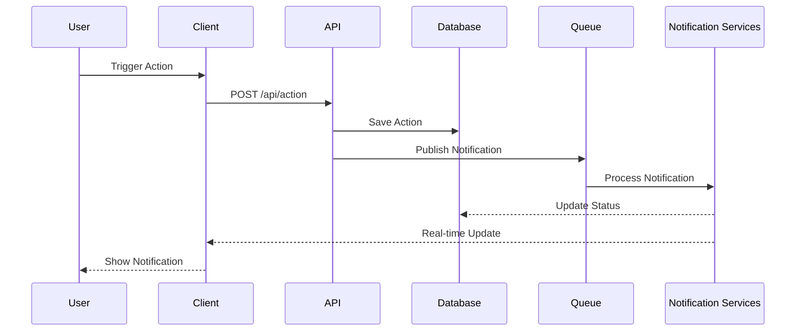

## Component Architecture

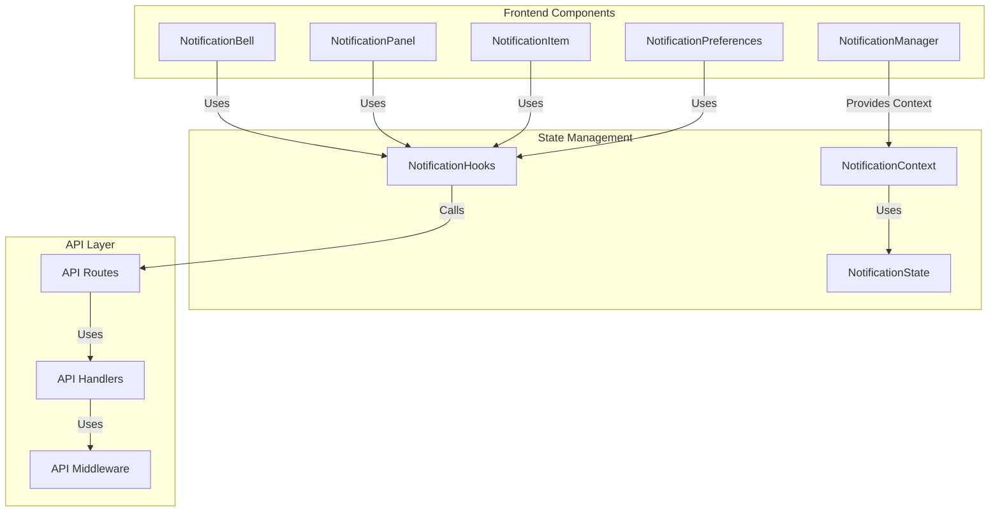

## Data Flow

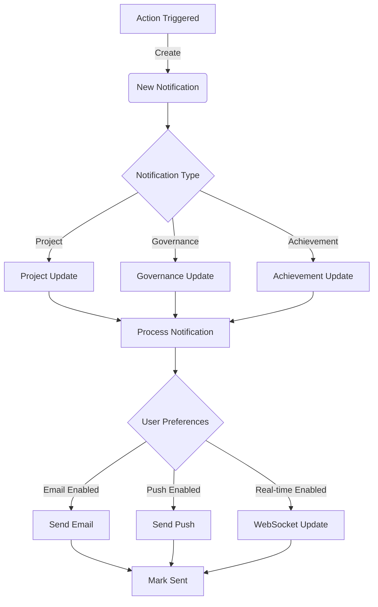

## State Management

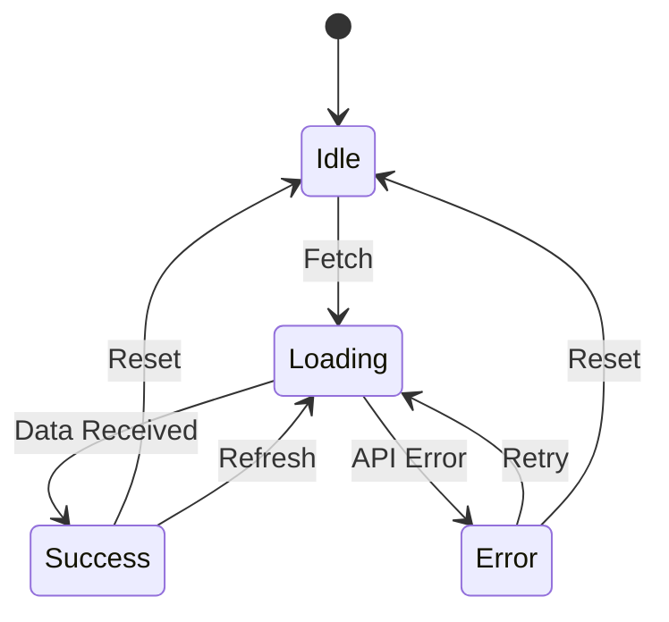

## Notification Categories

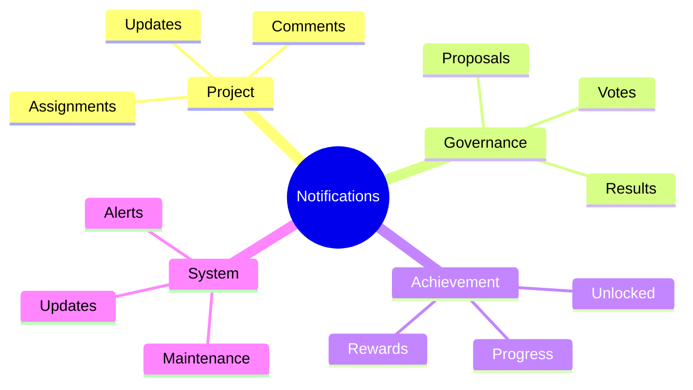

## Error Handling

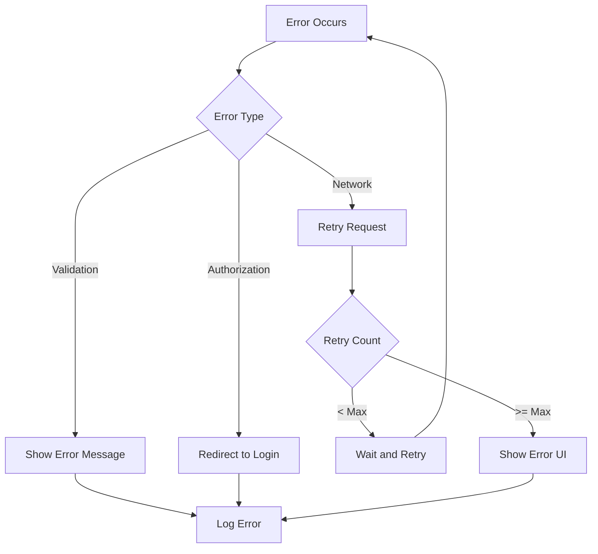

## Testing Strategy

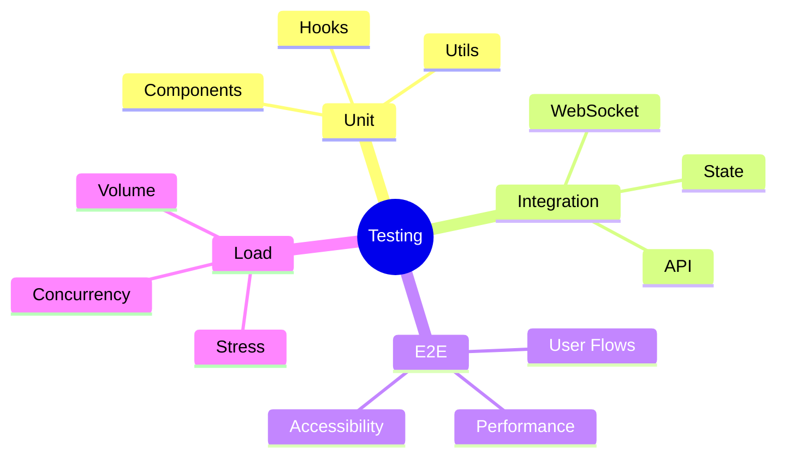

## Deployment Architecture

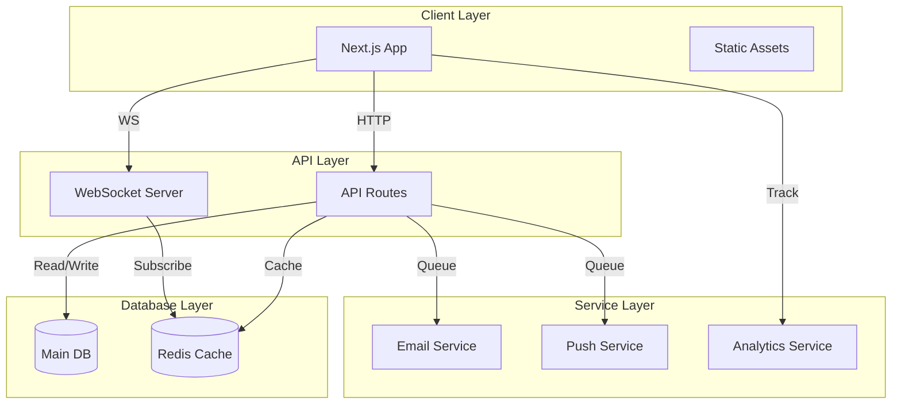

## User Preference Flow

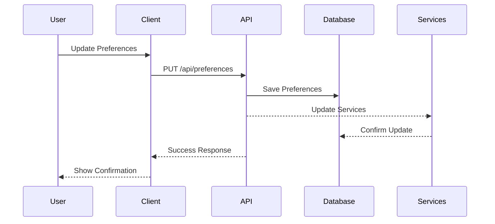

## Analytics Flow

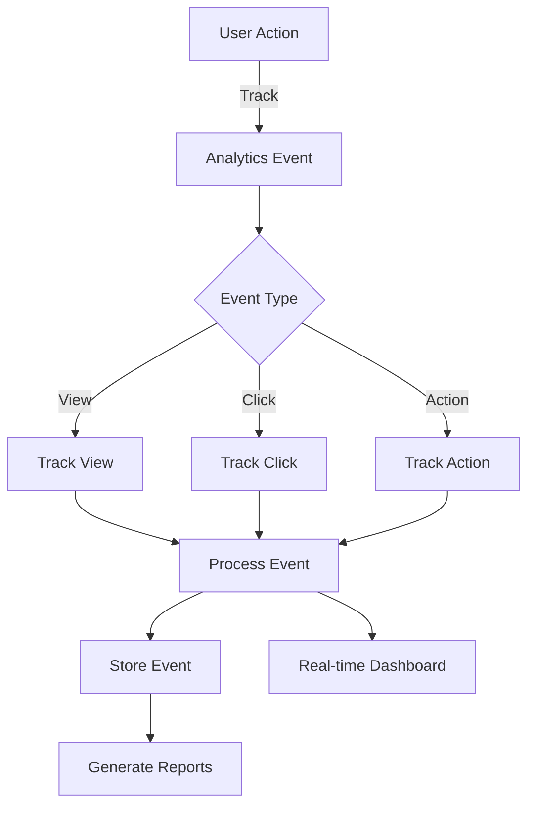
